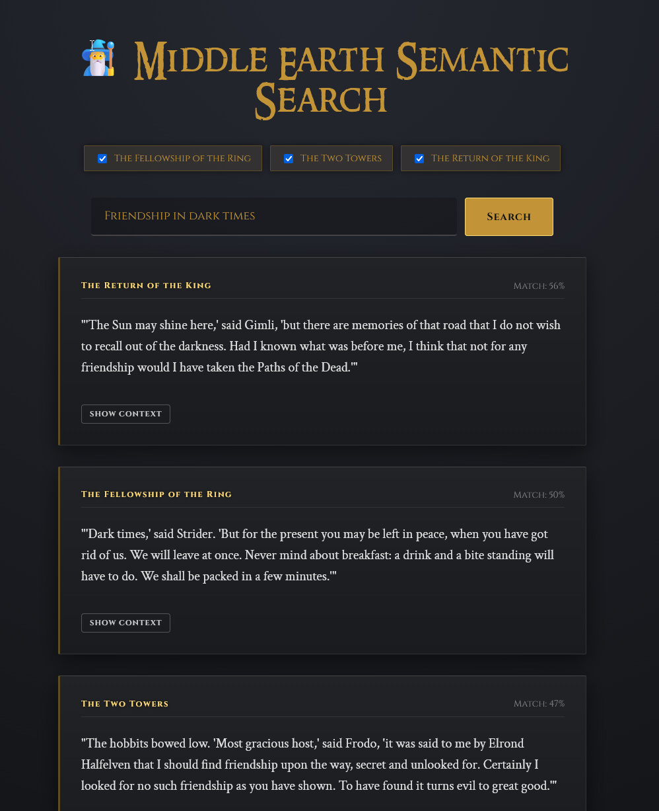

# 🧙‍♂️ Middle Earth Semantic Search

> "I will take the Ring," he said, "though I do not know the way."

A serverless, client-side AI search engine that allows users to search J.R.R. Tolkien's _The Lord of the Rings_ trilogy using natural language concepts rather than just keywords.



## ✨ Features

- **Semantic Search:** Search by meaning ("Friendship in dark times") rather than exact keywords.
- **Hybrid Search:** Combines vector similarity with keyword boosting (Exact Matches get a "🎯" badge).
- **100% Client-Side:** No backend API keys required. Runs entirely in the browser using [Transformers.js](https://huggingface.co/docs/transformers.js).
- **Context Awareness:** View the paragraphs immediately preceding and following a result.
- **Immersive UI:** A "Dark Fantasy" theme featuring custom fonts, glowing runic aesthetics, and smooth animations.

## 🛠️ How It Works

This project demonstrates the "Serverless AI" architecture. Instead of paying for OpenAI/Gemini/Anthropic API calls, we pre-calculate the intelligence.

1.  **Data Pipeline:** A Node.js script reads the raw `.txt` files of the trilogy.
2.  **Vectorization:** It uses the `all-MiniLM-L6-v2` model to convert ~10,000 paragraphs into 384-dimensional vectors.
3.  **Static Storage:** These vectors are saved to a static `embeddings.json` file.
4.  **Inference:** When a user types a query, the React app downloads a quantized version of the AI model to the browser, vectorizes the query on the fly, and performs a Dot Product similarity search against the JSON file.

## 🚀 Getting Started

This repository is split into two parts: the **Data Pipeline** (backend) and the **Web App** (frontend).

### Prerequisites

- Node.js v18 or higher

### 1. The Data Pipeline

Add your LOTR .txt files to `data-pipeline/books` then run this to generate the `embeddings.json` file.

```bash
cd data-pipeline
npm install
node generate-embeddings.js
# This will generate a ~20MB embeddings.json file
```

Move `embeddings.json` to `middle-earth-search/public`

### 2. The Web App

```bash
cd middle-earth-search
npm install
npm run dev
```

Open `http://localhost:5173` to gaze into the Palantír.

## 🏗️ Architecture

```text
/
├── data-pipeline/          # Node.js scripts
│   ├── books/              # Raw .txt files (LOTR Trilogy)
│   └── generate-embeddings.js  # Converts text to vectors
│
└── middle-earth-search/    # React (Vite) App
    ├── public/
    │   └── embeddings.json # The "Brain" (Static Vector DB)
    └── src/                # Frontend Logic
```

## 📚 Technologies Used

- **Frontend:** React, Vite
- **AI/ML:** @xenova/transformers (Transformers.js), ONNX Runtime
- **Algorithm:** Cosine Similarity / Dot Product
- **Styling:** CSS3 Variables, Google Fonts (Cinzel, Crimson Text)

## 🔮 Future Improvements

- [ ] Add _The Hobbit_ and _The Silmarillion_ to the corpus.

---

_“All we have to decide is what to do with the time that is given us.”_

## 📜 License

MIT © Robert McElhinney
